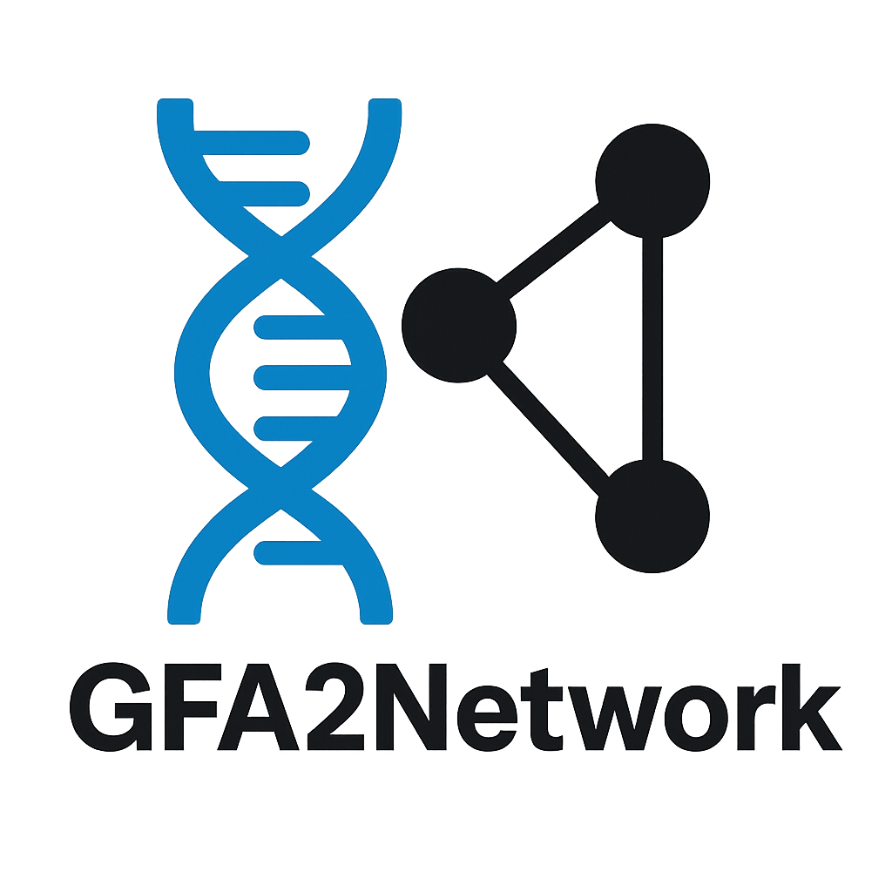

<p>
  
</p>

# GFA2Network: Memory-efficient GFA→Graph Converter

**GFA2Network** is a small Python library that converts
[GFA-1](https://github.com/GFA-spec/GFA-spec) and
[GFA-2](https://github.com/GFA-spec/GFA-spec/blob/master/GFA2.md) files into
convenient in-memory representations.  GFA (Graphical Fragment Assembly) is a
common exchange format for pangenome graphs.  This package reads those graphs in
a streaming fashion and exposes them either as a `networkx` graph object or as a
SciPy sparse adjacency matrix.  Even multi-million node graphs can be handled on
ordinary hardware because memory consumption grows roughly with the number of
edges.

The command **gfa2network** can build:

- a `networkx.Graph` / `DiGraph`, and/or
- a SciPy sparse adjacency matrix.

It reads the input file in a single pass and keeps memory usage roughly
proportional to the number of edges, so multi‑million node graphs can be
processed on ordinary hardware.

## Features

- Handles GFA‑1 and GFA‑2 link syntax
- Build directed or undirected graphs
- Stream parsing keeps memory proportional to edge count
- Optional edge weights from a tag (e.g. `RC`)
- Optional sequence storage on nodes
- Adjacency matrices in several sparse formats
- Helper utilities to convert or save matrices
- Bidirected graph representation via `--bidirected`
- Compute shortest path distances between sequences or genomes
- `distance` subcommand to query sequences or paths
- `distance-matrix` subcommand to compute pairwise path distances
- Export edges to various formats with the `export` subcommand
- Transparent support for gzip-compressed input files (`*.gfa.gz`)
- Shortest path distances between sequences or whole genomes

The adjacency matrix can be written in several SciPy sparse representations:

* **CSR (Compressed Sparse Row)** – efficient row slicing, used by default.
* **CSC (Compressed Sparse Column)** – efficient column slicing.
* **COO (Coordinate)** – straightforward triplet format, convenient for
  incremental construction.
* **DOK (Dictionary of Keys)** – a hash map representation useful for updates.

These formats are explained in more detail in the
[SciPy documentation](https://docs.scipy.org/doc/scipy/reference/sparse.html).

The repository ships with a real world test graph,
[`DRB1-3123_unsorted.gfa`](tests/data/DRB1-3123_unsorted.gfa), containing about
9500 lines from the human *DRB1* region.  Use it to experiment with the CLI
or run the unit tests:

```bash
gfa2network tests/data/DRB1-3123_unsorted.gfa \
    --graph --matrix drb1.npz --verbose
```

Run the small test suite with:

```bash
python -m pytest
```

## Installation

Install the package directly from GitHub using `pip`:

```bash
pip install git+https://github.com/sclipman/gfa2network.git
```


## Dependencies

Install the requirements with:

```bash
pip install -r requirements.txt
```

For optional progress bars, you can install the extra dependency with:

```bash
pip install -e ".[tqdm]"
```

This project targets Python 3.8 or later and depends on the following packages:
- `networkx`, `numpy` and `scipy` for graph handling and sparse matrices
- `tqdm` (optional) for progress bars on long‑running operations
- `pytest` (optional) for running the unit tests
- `python-igraph` (optional) for the igraph backend

## Quick Start

The examples below illustrate typical use cases.  Replace `input.gfa` with your
own data set.  Files may also be gzip-compressed (`input.gfa.gz`).

```bash
# Build both representations (directed NetworkX graph and CSR matrix)
gfa2network convert input.gfa --graph --matrix adj.npz

# Matrix only (uses the least amount of memory) in the COO format
gfa2network convert input.gfa --matrix adj.npz --matrix-format coo

# Directed graph only with verbose progress output
gfa2network convert input.gfa --graph --verbose

# Build an igraph representation and save it to disk
gfa2network convert input.gfa --graph --backend igraph -o graph.pkl

# Stream from standard input and strip orientation symbols (legacy behaviour)
cat input.gfa | gfa2network convert - --graph --strip-orientation

# Compute basic graph statistics
gfa2network stats input.gfa

# Export a simple edge list
gfa2network export input.gfa --format edge-list > edges.txt

# Shortest path between two sequences
gfa2network distance input.gfa --seq ACGT TTTT

# Distance between two paths
gfa2network distance input.gfa --path sample1 sample2

# Pairwise distances between all paths
gfa2network distance-matrix input.gfa -o distances.csv

```


See `gfa2network -h` for all command line options.

| Option             | Purpose |
| ------------------ | ------- |
| `convert`          | Convert a GFA into graph and/or matrix |
| `stats`            | Print basic statistics |
| `export`           | Stream edges in various formats |
| `distance`         | Compute distances between sequences or paths |
| `distance-matrix`  | Compute pairwise path distances |
| `--graph`          | Build a NetworkX object |
| `--matrix PATH`    | Write adjacency matrix to PATH |
| `--matrix-format`  | Sparse format for `.npz`. One of `csr`, `csc`, `coo` or `dok` |
| `-o PATH, --output PATH` | Save graph pickle to PATH |
| `--backend`        | Backend for graph building (`networkx`\|`igraph`) |
| `--directed`       | Treat graph as directed (default) |
| `--undirected`     | Treat graph as undirected |
| `--weight-tag TAG` | Use numeric value of GFA tag `TAG` as edge weight |
| `--store-seq`      | Keep sequences from `S` records on nodes |
| `--strip-orientation` | Remove `+/-` from IDs (legacy) |
| `--bidirected`     | Use bidirected node representation |
| `--raw-bytes-id`   | Use legacy byte strings for node IDs |
| `--keep-directed-bidir` | Keep directed bidirected edges |
| `--verbose`        | Emit progress information |

`--store-seq` may drastically increase memory usage. The parser will warn when the
stored sequences exceed half of the available RAM. The flag is ignored when only
`--matrix` is requested.

## Using in Python

Import the convenience function `parse_gfa` in your own Python scripts in order
to generate graphs programmatically:

```python
from gfa2network import parse_gfa

# Build a NetworkX graph
G = parse_gfa("input.gfa", build_graph=True, build_matrix=False)
# Compressed input works as well
Gz = parse_gfa("input.gfa.gz", build_graph=True, build_matrix=False)
# Store sequences on nodes
G_seq = parse_gfa("input.gfa", build_graph=True, build_matrix=False, store_seq=True)
```

Additional helpers are provided in ``gfa2network.analysis``:

```python
from gfa2network.analysis import sequence_distance, genome_distance, load_paths

# Distance between two sequences stored on nodes
dist = sequence_distance(G_seq, "ACGT", "TTTT")

# Load path definitions and compare two genomes
paths = load_paths("input.gfa")
dist2 = genome_distance(G, paths["p1"], paths["p2"])

# Pairwise distances between all paths
mat = genome_distance_matrix("input.gfa")
```

`sequence_distance` locates nodes by their stored sequence strings and returns
the shortest path length between them.  `genome_distance` accepts two node
sets and calculates either the minimal or mean distance (``method="min"`` or
``"mean"``).  The helper ``load_paths`` reads ``P`` or ``O`` records from a GFA
file and maps path names to node lists for convenient lookup. ``genome_distance_matrix``
computes all pairwise distances between paths and returns a matrix or dataframe.

Pass `store_seq=True` to attach the sequences from `S` records as the
`sequence` attribute on each node.  You can also set `directed=False` for an
undirected graph or specify a `weight_tag` to use numeric edge weights.  The
module additionally exposes a helper `convert_format` to turn the returned COO
matrix into CSR/CSC/DOK formats.

### ``parse_gfa`` parameters

| Argument | Meaning |
| -------- | ------- |
| ``path`` | Input GFA file or ``-`` for stdin |
| ``build_graph`` | Return a NetworkX graph |
| ``build_matrix`` | Return an adjacency matrix |
| ``directed`` | Treat graph as directed (default ``True``) |
| ``weight_tag`` | Numeric GFA tag to use as edge weight |
| ``store_seq`` | Attach sequences to nodes |
| ``strip_orientation`` | Remove ``+/-`` from segment IDs |
| ``verbose`` | Print progress messages |
| ``bidirected`` | Append orientation to node IDs |
| ``raw_bytes_id`` | Use byte strings for node IDs |

## Implementation Notes

The parser recognises segment (`S`), link (`L`), edge (`E`), containment (`C`)
and path/walk (`P`/`O`) records of the GFA specification. Orientation symbols
`+` and `-` are retained by default so that the directionality of edges and paths
is preserved.  The option `--strip-orientation` reproduces the historic
behaviour of discarding these signs.  All additional GFA tags are collected into
a dictionary, enabling the use of numeric tags as edge weights via the
`--weight-tag` option.

## Output

When invoked as a script, the resulting NetworkX graph is available as the
variable `G`.  The `-o`/`--output` option stores this graph on disk (either as a
NetworkX pickle or as an igraph pickle, depending on the backend).  If
`--matrix` is specified, the adjacency matrix is saved to the given file
(`.npz`, `.npy` or `.csv`).  Matrices are initially produced in the COO format
and may subsequently be converted to another sparse representation using the
`convert_format` helper function.

## License

This project is licensed under the MIT License. See [LICENSE](LICENSE) for
details.

## Disclaimer
This software is supplied 'as-is', with no warranty of any kind expressed or implied. The author has made a reasonable effort to avoid errors in design and execution of this software, but will not be liable for its use or misuse. The user is solely responsible for the validity of any results generated. Specifically, the author is not liable for any damage or data loss resulting from the use of this software, even if it is due to negligence on the part of the author of this software. This software and this document are the responsibility of the author. The views expressed herein do not necessarily represent the views of Johns Hopkins University.
